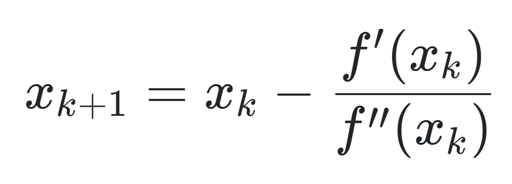
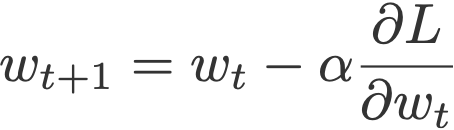
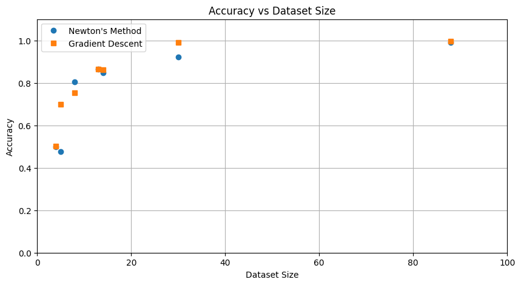

# Logistic Regression with Newton and Gradient Descent

## Introduction 

The scope of this project consists in creating a logistic regression class, featuring either the Gradient Descent Method (with Armijo's rule) or the Newton Method for weights and bias tuning. 

The goal with this is to demonstrate the efficiency, advantages and drawbacks of both methods in terms of time, accuracy, and learning convergence, depending on the evaluated dataset size in features and samples. 

 Newton's method, where f'() represents the gradient and f''() the Hessian 

Gradient Descent method, where alpha represents a scalar learning rate

## Repository structure

Given that the whole project consists on a single Google Colab notebook, aside from .csv files containing most of the datasets (2 of the datasets were loaded via URL, and another one was imported from the sklearn library), my repository is structured as follows: 

* Newton vs GD for Logistic Regression.ipynb: the Colab notebook, with full descriptions of each step, function and class. 
* Newton vs GD for Logistic Regression.py: the raw Python code, for simpler loading and replication 
* Newton vs GD.zip: with the .csv files to be loaded on the project via pd.read_csv
* images: with the results plots
* README.md: this file

## Libraries used

The libraries used were time, random, pandas, numpy, sklearn and matplotlib. All of them are accessible from most Python versions and IDEs, and I import them at the very beginning of my code

## How to run the code

1. Download the file
2. Download the /data folder and load the files into your online notebook, or directly into your Python file by modifying the paths within the pd.read_csv methods to search the files within their folder
3. Run the code 
4. You can toggle parameters such as learning rate, weight decay, gamma and delta

## Used datasets

I used a total of 9 binary classification datasets: 

1. Breast cancer wisconsin dataset: 30 features and 569 samples
1. Car accident survival: 200 samples and 5 features
1. Twitter bot detection: 50,000 samples and 11 features
1. Diabetes: 8 features and 768 samples
1. Heart disease: 4236 samples and 15 features
1. Loan approval: 45,000 samples and 13 features
1. Phishing websites: 11,340 samples and 88 features
2. A2A: with 2265 samples and 120 features
3. W4A: with 7366 samples and 301 features

## Results and conclusions

I noticed when running my algorithm, how the worst performance happened on the Twitter dataset, which although it was almost perfectly-balanced, featured lots of text, non-categorical data, which heavily hindered the model's learning. Another dataset that suffered a poor performance was the Car Accident dataset, but the performance for that one also suffered a great variance, hopping between 45 and 70%, which I consider was due its small size (less than 200 samples)

The best performance happened with the Phishing Websites dataset, with an almost perfect score for both methods. Additionally, this dataset was the only perfectly-balanced one.

We can see in the graph below, how Newton's method always required many fewer iterations than GD, and yielded a very similar accuracy.

There doesn't seem to be any correlation between the amount of features in a dataset, and the reached accuracy

It is still necessary to test this algortihm with datasets with higher amounts of features. Given the results, the ideal dataset must include at least 1000 samples, only numerical (or at least categorical) features, and have its classes as balanced as possible. Nevertheless, I consider my algorithm works very well, given it's high performance on the largest and best balanced dataset, as we can see in the above graph. 
